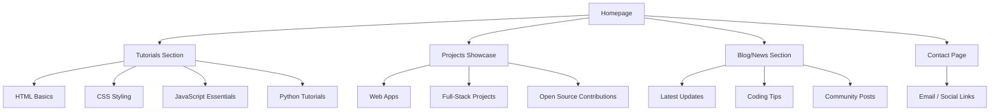
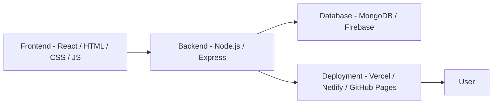

# 🚀 Coding Website

A modern, responsive website dedicated to coding tutorials, resources, and projects.

---

## 📊 Project Flow



---

## 🧠 About

This project provides a clean, intuitive platform for sharing coding knowledge — tutorials, code snippets, project showcases, and blog posts.

---

## ✨ Features

* Responsive design for desktop, tablet, and mobile
* Dark and light themes
* Tutorials for HTML, CSS, JavaScript, Python, and more
* Code snippet viewer with syntax highlighting
* Project showcase with live previews
* Blog/news section for updates

---

## 🎗️ System Architecture



---

## 🛠️ Technologies Used

* **Front-End:** HTML5, CSS3, JavaScript (ES6+)
* **Frameworks/Libraries:** TailwindCSS, React (optional)
* **Deployment:** GitHub Pages / Vercel / Netlify
* **Version Control:** Git & GitHub

---

## ⚙️ Getting Started

### Prerequisites

Make sure you have the following installed:

* Node.js (v14+)
* npm or yarn
* A modern browser

### Installation

```bash
git clone https://github.com/dharanitharan27/Coding_Website.git
cd Coding_Website
npm install
npm start
```

---

## 📁 Project Structure

```bash
/Coding_Website
│
├── /assets       # images, icons, fonts
├── /css          # styles
├── /js           # JavaScript files
├── /tutorials    # tutorials
├── /projects     # project showcase
├── /blog         # blog posts
├── index.html    # homepage
└── README.md     # this file
```

---

## 🤝 Contributing

Contributions are welcome!
Follow these steps to contribute:

```bash
# 1. Fork the repository
# 2. Create a new branch
git checkout -b feature/my-feature

# 3. Commit your changes
git commit -m "Add feature"

# 4. Push your branch
git push origin feature/my-feature
```

Then, open a Pull Request 🚀

---

## 🧾 License

This project is licensed under the **MIT License**.
Feel free to use, modify, and share responsibly.

---

## 📬 Contact

* **GitHub:** [dharanitharan27](https://github.com/dharanitharan27)
* **Email:** [dharanitharan725@gmail.com](mailto:dharanitharan725@gmail.com)
